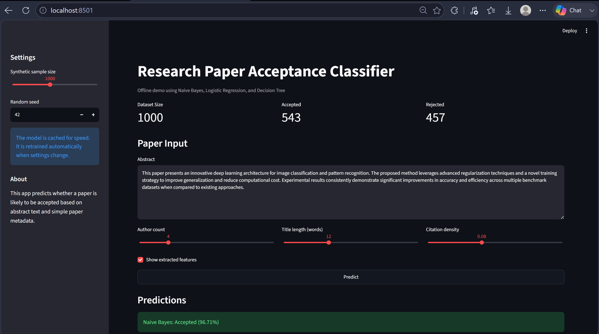
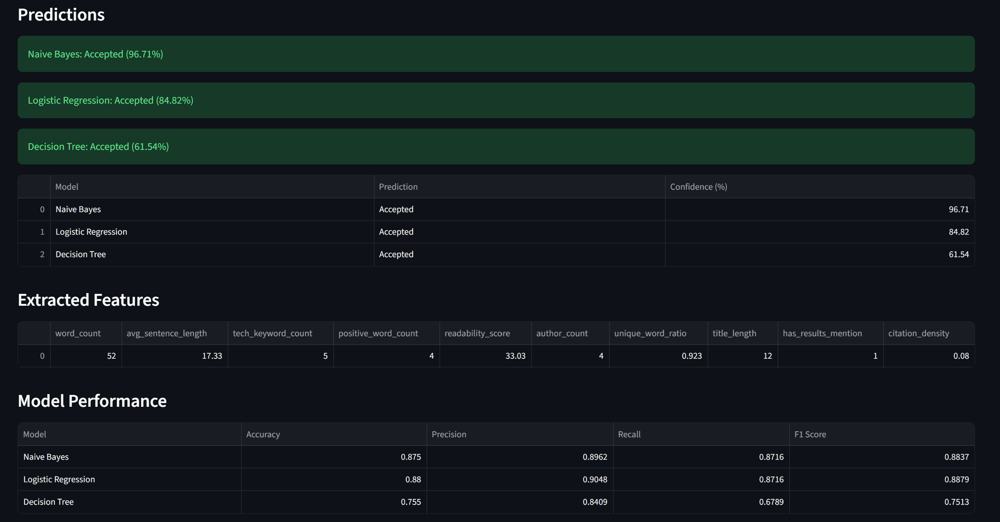
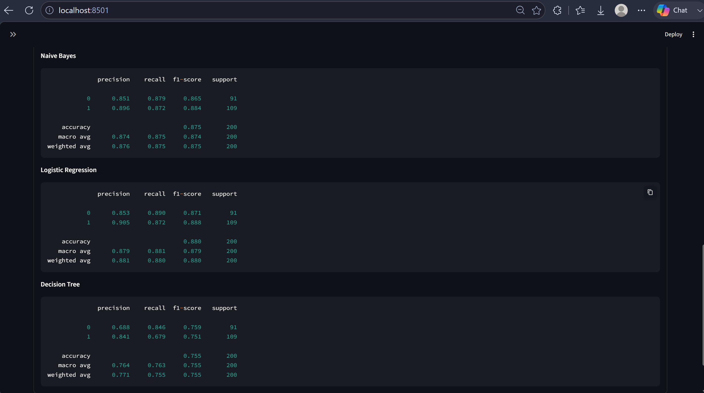
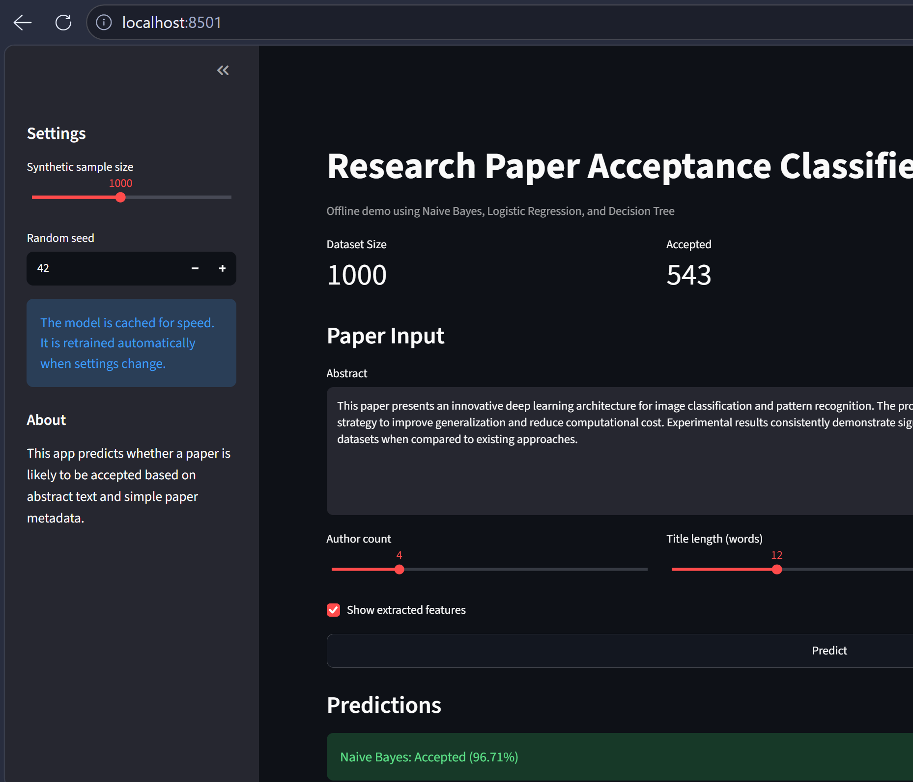

# 📄 Research Paper Acceptance Classifier

> A Machine Learning-based web application that predicts whether a research paper is likely to be accepted based on its abstract and extracted textual features.


---

## 📖 Overview

The **Research Paper Acceptance Classifier** is an interactive Machine Learning application that predicts the acceptance status of research papers using Natural Language Processing (NLP) techniques and multiple classification algorithms.

Users can input a research paper abstract, compare different machine learning models, visualize evaluation metrics, and analyze extracted text features through a clean Streamlit interface.

---

## ✨ Features

- 📄 Predict paper acceptance from research abstracts
- 🤖 Compare multiple Machine Learning models
- 📊 Model performance comparison
- 📈 Classification reports
- 🎯 Confusion matrix visualization
- 📉 Correlation heatmap
- ⭐ Feature importance analysis
- 🔍 Text feature extraction
- 🌐 Interactive Streamlit dashboard

---

## 🛠️ Tech Stack

- Python
- Streamlit
- Scikit-learn
- Pandas
- NumPy
- Matplotlib

---

## 📂 Project Structure

```text
Research-Paper-Classifier/
│
├── app.py
├── research_paper_acceptance_classifier.py
├── requirements.txt
├── README.md
├── screenshots/
├── outputs/
└── .gitignore
```

---

## 🚀 Installation

Clone the repository

```bash
git clone https://github.com/Pragnya-Muchalambe/Research-Paper-Classifier.git
```

Navigate to the project

```bash
cd Research-Paper-Classifier
```

Install dependencies

```bash
pip install -r requirements.txt
```

Run the application

```bash
streamlit run app.py
```

---

## 📸 Screenshots

### 🏠 Home Page



---

### 📄 Prediction Result



---

### 📊 Model Performance



---

### ⚙️ Dashboard Settings



---

## 📈 Model Evaluation

The project evaluates multiple Machine Learning models using:

- Accuracy
- Precision
- Recall
- F1 Score
- Confusion Matrix
- Classification Report

---

## 🔮 Future Improvements

- Deep Learning models
- Transformer-based NLP (BERT)
- PDF research paper upload
- Explainable AI (XAI)
- Model deployment on cloud

---

## 👩‍💻 Author

**Pragnya Muchalambe**

GitHub: https://github.com/Pragnya-Muchalambe